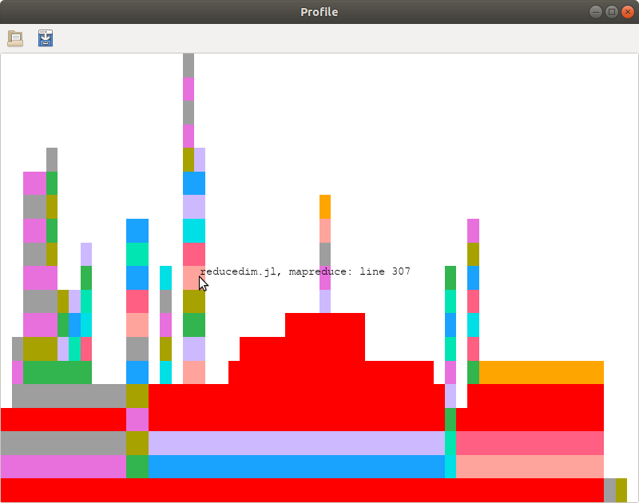

# ProfileView.jl

[](https://travis-ci.org/timholy/ProfileView.jl)
[![PkgEval][pkgeval-img]][pkgeval-url]

**NOTE**: Jupyter/IJulia and SVG support has migrated to the [ProfileSVG](https://github.com/timholy/ProfileSVG.jl) package.

# Introduction

This package contains tools for visualizing profiling data collected with [Julia's][Julia] built-in sampling [profiler][Profiling]. It can be helpful for getting a big-picture overview of the major bottlenecks in your code, and optionally highlights lines that trigger garbage collection as potential candidates for optimization.

This type of plot is known as a [flame graph](https://github.com/brendangregg/FlameGraph).
The main logic is handled by the [FlameGraphs][FlameGraphs] package; this package is just a visualization front-end.

## Installation

Within Julia, use the [package manager][pkg]:
```julia
using Pkg
Pkg.add("ProfileView")
```

## Usage and visual interpretation

To demonstrate ProfileView, first we have to collect some profiling data. Here's a simple test function for demonstration:

```julia
function profile_test(n)
    for i = 1:n
        A = randn(100,100,20)
        m = maximum(A)
        Am = mapslices(sum, A; dims=2)
        B = A[:,:,5]
        Bsort = mapslices(sort, B; dims=1)
        b = rand(100)
        C = B.*b
    end
end

using ProfileView
@profview profile_test(1)  # run once to trigger compilation (ignore this one)
@profview profile_test(10)
```

`@profview f(args...)` is just shorthand for `Profile.clear(); @profile f(args...); ProfileView.view()`.

If you're following along, you should see something like this:



(Note that collected profiles can vary from run-to-run, so don't be alarmed
if you get something different.)
This plot is a visual representation of the *call graph* of the code that you just profiled.
The "root" of the tree is at the bottom; if you move your mouse along the long horizontal
bar at the bottom, you'll see a tooltip that's something like
```
boot.jl, eval: 331
```
This refers to one of Julia's own source files, [base/boot.jl][bootjl].
`eval` is the name of the function being executed, and `331` is the line number of the file.
This is the function that evaluated your `profile_test(10)` command that you typed at the REPL.
(Indeed, to reduce the amount of internal "overhead" in the flamegraph, some of these internals are truncated; see the `norepl` option of `FlameGraphs.flamegraph`.)
If you move your mouse upwards, you'll then see bars corresponding to the function(s) you ran with `@profview` (in this case, `profile_test`).
Thus, the vertical axis represents nesting depth: bars lie on top of the bars that called them.

The horizontal axis represents the amount of time (more precisely, the
number of backtraces) spent at each line.  The row at which the single
long bar breaks up into multiple different-colored bars corresponds
to the execution of different lines from `profile_test`.
The fact that they are all positioned on top of the lower peach-colored bar means that all
of these lines are called by the same "parent" function. Within a
block of code, they are sorted in order of increasing line number, to
make it easier for you to compare to the source code.

From this visual representation, we can very quickly learn several things about this function:

- On the right side, you see a stack of calls to functions in `sort.jl`.
  This is because sorting is implemented using recursion (functions that call themselves).

- `mapslices(sum, A; dims=2)` is considerably more expensive (the corresponding bar is horizontally wider) than
  `mapslices(sort, B; dims=1)`. This is because it has to process more
  data.

It is also worth noting that red is (by default) a special color: it is reserved for function
calls that have to be resolved at run-time.
Because run-time dispatch (aka, dynamic dispatch, run-time method lookup, or
a virtual call) often has a significant
impact on performance, ProfileView highlights the problematic call in red. It's
worth noting that some red is unavoidable; for example, the REPL can't
predict in advance the return types from what users type at the
prompt, and so the bottom `eval` call is red.
Red bars are problematic only when they account for a sizable
fraction of the top of a call stack, as only in such cases are they likely to be
the source of a significant performance bottleneck.
We can see that `mapslices` relies on run-time dispatch;
from the absence of pastel-colored bars above much of the red, we
might guess that this makes a substantial contribution to its total run time.

## GUI features

### Gtk Interface

- Ctrl-q and Ctrl-w close the window. You can also use
  `ProfileView.closeall()` to close all windows opened by ProfileView.

- Left-clicking on a bar will cause information about this line to be
  printed in the REPL. This can be a convenient way to "mark" lines
  for later investigation.

- Right-clicking on a bar calls the `edit()` function to open the line
  in an editor.  (On a trackpad, use a 2-fingered tap.)

- CTRL-clicking and dragging will zoom in on a specific region of the image.  You
  can also control the zoom level with CTRL-scroll (or CTRL-swipe up/down).

  CTRL-double-click to restore the full view.

- You can pan the view by clicking and dragging, or by scrolling your
  mouse/trackpad (scroll=vertical, SHIFT-scroll=horizontal).

- The toolbar at the top contains two icons to load and save profile
  data, respectively.  Clicking the save icon will prompt you for a
  filename; you should use extension `*.jlprof` for any file you save.
  Launching `ProfileView.view(nothing)` opens a blank
  window, which you can populate with saved data by clicking on the
  "open" icon.

**NOTE**: ProfileView does not support the old JLD-based `*.jlprof` files anymore.
Use the format provided by FlameGraphs v0.2 and higher.

## Command-line options

The `view` command has the following syntax:
```
function view([fcolor,] data = Profile.fetch(); lidict = nothing, C = false, fontsize = 30, kwargs...)
```
Here is the meaning of the different arguments:

- `fcolor` optionally allows you to control the scheme used to select
  bar color. This can be quite extensively customized; see [FlameGraphs](https://timholy.github.io/FlameGraphs.jl/stable/) for details.

- `data` is the vector containing backtraces. You can use `data1 =
  copy(Profile.fetch()); Profile.clear()` to store and examine results
  from multiple profile runs simultaneously.

- `lidict` is a dictionary containing "line information."
  See the section on saving profile data below.

- `C` is a flag controlling whether lines corresponding to C and Fortran
  code are displayed. (Internally, ProfileView uses the information
  from C backtraces to learn about garbage-collection and to
  disambiguate the call graph).

- `fontsize` controls the size of the font displayed as a tooltip.

These are the main options, but there are others; see FlameGraphs for more details.

## Source locations & Revise (new in ProfileView 0.5.3)

Profiling and [Revise](https://github.com/timholy/Revise.jl) are natural partners,
as together they allow you to iteratively improve the performance of your code.
If you use Revise and are tracking the source files (either as a package or with `includet`),
the source locations (file and line number) reported by ProfileView
will match the current code at the time the window is created.


[Julia]: http://julialang.org "Julia"
[Profiling]: https://docs.julialang.org/en/v1/manual/profile/
[FlameGraphs]: https://github.com/timholy/FlameGraphs.jl
[pkg]: https://docs.julialang.org/en/latest/stdlib/Pkg/
[bootjl]: https://github.com/JuliaLang/julia/blob/2e6715c045042e1c8ae9adc7a578340649b0ad5a/base/boot.jl#L330
[pkgeval-img]: https://juliaci.github.io/NanosoldierReports/pkgeval_badges/P/ProfileView.svg
[pkgeval-url]: https://juliaci.github.io/NanosoldierReports/pkgeval_badges/report.html
