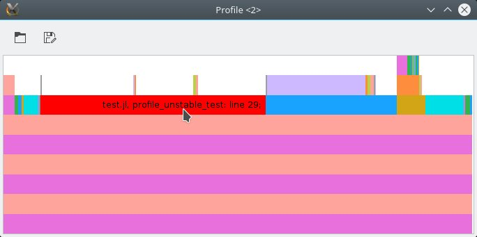

# ProfileView.jl

[](https://travis-ci.org/timholy/ProfileView.jl)

# NEWS

Version 0.2 of ProfileView has several major changes:

- Red highlighting has been restored; it now highlights
  type-instabilities, not garbage collection, as a means to better
  distinguish legitimate uses of allocation from ones that might be
  avoidable.

- For users of the Gtk version, ProfileView has switched from
  [GtkUtilities](https://github.com/timholy/GtkUtilities.jl) to
  [GtkReactive](https://github.com/JuliaGizmos/GtkReactive.jl).  One
  consequence is that you now need to hold down Ctrl for any zoom
  operation.  You can now shift the displayed region by click-dragging
  on the image.

- Also for users of the Gtk version, Ctrl-q and Ctrl-w close the
  window. You can also use `ProfileView.closeall()` to close all
  windows opened by ProfileView.

# Introduction

This package contains tools for visualizing profiling data collected
with [Julia's][Julia] built-in sampling
[profiler](http://docs.julialang.org/en/latest/stdlib/profile/). It
can be helpful for getting a big-picture overview of the major
bottlenecks in your code, and optionally highlights lines that trigger
garbage collection as potential candidates for optimization.

This type of plot is known as a [flame
graph](https://github.com/brendangregg/FlameGraph).

## Installation

Within Julia, use the package manager:
```julia
Pkg.add("ProfileView")
```

## Usage and visual interpretation

To demonstrate ProfileView, first we have to collect some profiling
data. Here's a simple test function for demonstration:

```julia
function profile_test(n)
    for i = 1:n
        A = randn(100,100,20)
        m = maximum(A)
        Afft = fft(A)
        Am = mapslices(sum, A, 2)
        B = A[:,:,5]
        Bsort = mapslices(sort, B, 1)
        b = rand(100)
        C = B.*b
    end
end

profile_test(1)  # run once to trigger compilation
Profile.clear()  # in case we have any previous profiling data
@profile profile_test(10)
```
Now that we have profiling data, visualizing it is a simple matter:
```
julia> using ProfileView

julia> ProfileView.view()
```
If you're following along, you should see something like this:


This plot is a visual representation of the *call graph* of the code that you just profiled. The "root" of the tree is at the bottom; if you move your mouse over the long horizontal magenta bar at the bottom, you'll see it's an anonymous function in `REPL.jl`; the orangish one above that is `eval_user_input` in the same function. As is explained [elsewhere](http://docs.julialang.org/en/latest/stdlib/profile/), these are what run your code in the REPL. If you move your mouse upwards, you'll eventually get to the function(s) you ran with `@profile`.

While the vertical axis therefore represents nesting depth, the
horizontal axis represents the amount of time (more precisely, the
number of backtraces) spent at each line.  One sees on the 4th line
from the bottom, there are several differently-colored bars, each
corresponding to a different line of `profile_test`. The fact that
they are all positioned on top of the lower magenta bar means that all
of these lines are called by the same "parent" function. Within a
block of code, they are sorted in order of increasing line number, to
make it easier for you to compare to the source code.

From this visual representation, we can very quickly learn several
things about this function:

- The most deeply-nested line corresponds to `mapslices(sort, B, 1)`,
  resulting in the tall "stack" of bars on the right edge. However,
  this call does not take much time, because these bars are narrow
  horizontally.

- In contrast, the two most time-consuming operations are the calls to
  `fft` and `mapslices(sum, A, 2)`. (This is more time-consuming than
  the `mapslices(sort,...)` simply because it has to process more
  data.)

Now let's look at another example function:

```julia
unstable(x) = x > 0.5 ? true : 0.0

function profile_unstable_test(m, n)
    s = s2 = 0
    for i = 1:n
        for k = 1:m
            s += unstable(rand())
        end
        x = collect(1:20)
        s2 += sum(x)
    end
    s, s2
end

profile_unstable_test(1, 1)
Profile.clear()
@profile profile_unstable_test(10, 10^6)
ProfileView.view()
```

The main thing to note about this function is that the function
`unstable` is not inferrable; it can return either a `Bool` or a
`Float64` depending on the *value* (not type) of `x`.  When we
visualize the profiling results for this function, we see something
like the following:



In this plot, red is a special color: it is reserved for function
calls that are deduced to be non-inferrable (here by executing the C
function `jl_invoke`). Because type-instability often has a
significant impact on performance, we highlight the problematic call
in red.

## GUI features

### Gtk Interface

- Right-clicking on a bar will cause information about this line to be
  printed in the REPL. This can be a convenient way to "mark" lines
  for later investigation.

- Click-drag lets you zoom in on a specific region of the
  image. Double-click to restore the full view. You can pan by
  scrolling the mouse (scroll=vertical, SHIFT-scroll=horizontal), and
  change zoom level with CTRL-scroll. You can also use your keyboard
  (arrow keys, plus SHIFT and CTRL modifiers).

- To use the Gtk interface in IJulia, set `PROFILEVIEW_USEGTK = true` in
  the `Main` module before `using ProfileView`.

- The toolbar at the top contains two icons to load and save profile
  data, respectively.  Clicking the save icon will prompt you for a
  filename.  Launching `ProfileView.view(nothing)` opens a blank
  window; you can populate it with saved data by clicking on the
  "open" icon.

### IJulia (SVG) Interface

- Double-clicking on a bar will zoom in the graph around the bar.

- Double-clicking on the background will zoom out to show the entire graph.

- Click-drag anywhere on the graph will allow for panning.

## Command-line options

The `view` command has the following syntax:
```
function view(data = Profile.fetch(); lidict = nothing, C = false, colorgc = true, fontsize = 12, combine = true, pruned = [])
```
Here is the meaning of the different arguments:

- The first is the vector containing backtraces. You can use `data1 =
  copy(Profile.fetch()); Profile.clear()` to store and examine results
  from multiple profile runs simultaneously.

- `lidict` is a dictionary containing "line information."
  See the section on saving profile data below.

- `C` is a flag controlling whether lines corresponding to C and Fortran
  code are displayed. (Internally, ProfileView uses the information
  from C backtraces to learn about garbage-collection and to
  disambiguate the call graph).

- `colorgc`, when `true`, causes lines triggering garbage-collection
  to be displayed in red.

- `fontsize` controls the size of the font displayed as a tooltip.

- `combine` is explained [elsewhere](http://docs.julialang.org/en/latest/stdlib/profile/).

- `pruned` is a list of functions (see example) whose call tree will not be displayed. This is useful to control the output of very deep (or recursive) functions. Example: `pruned = [("sort!", "sort.jl"), ("some_function_name", "some_filename.jl")]`

### Saving profile data manually

If you're using the Gtk backend, the easiest approach is to click on
the "Save as" icon.

From the REPL, you can save profile data for later viewing and analysis using the JLD file format.
The main trick is that the backtrace data, on its own, is only valid within a particular
julia session. To become portable, you have to save "line information" that looks
up the particular line number in the source code corresponding to a particular
machine instruction. Here's an example:

```julia
li, lidict = Profile.retrieve()
using JLD
@save "/tmp/foo.jlprof" li lidict
```
Now open a new julia session, and try the following:
```
using HDF5, JLD, ProfileView
@load "/tmp/profdata.jld"
ProfileView.view(li, lidict=lidict)
```

### Saving ProfileView visualizations

You can share your profiling results with others either as an SVG file or
as an IJulia notebook. Simply use
```
ProfileView.svgwrite("profile_results.svg")
```
or
```
ProfileView.svgwrite("profile_results.svg", bt, lidict)
```
if you've `retrieve`d stored data.

Alternatively, run ProfileView inside an IJulia notebook and then save the notebook.

[Julia]: http://julialang.org "Julia"
