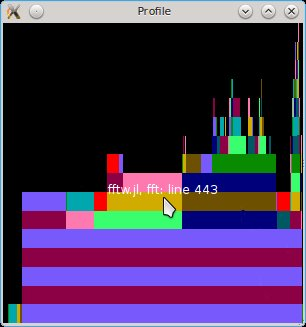

# ProfileView.jl

[](https://travis-ci.org/timholy/ProfileView.jl)

Note this README is for users of Julia 0.7 and higher; users of earlier versions
should see [this page](https://github.com/timholy/ProfileView.jl/tree/julia0.6).

# Introduction

This package contains tools for visualizing profiling data collected
with [Julia's][Julia] built-in sampling
[profiler][Profiling]. It
can be helpful for getting a big-picture overview of the major
bottlenecks in your code, and optionally highlights lines that trigger
garbage collection as potential candidates for optimization.

This type of plot is known as a [flame
graph](https://github.com/brendangregg/FlameGraph).

## Installation

Within Julia, use the package manager:
```julia
Pkg.add("ProfileView")
```

## Usage and visual interpretation

To demonstrate ProfileView, first we have to collect some profiling
data. Here's a simple test function for demonstration:

```julia
function profile_test(n)
    for i = 1:n
        A = randn(100,100,20)
        m = maximum(A)
        Am = mapslices(sum, A; dims=2)
        B = A[:,:,5]
        Bsort = mapslices(sort, B; dims=1)
        b = rand(100)
        C = B.*b
    end
end

profile_test(1)  # run once to trigger compilation
using Profile
Profile.clear()  # in case we have any previous profiling data
@profile profile_test(10)
```
Now that we have profiling data, visualizing it is a simple matter:
```
julia> using ProfileView

julia> ProfileView.view()
```
If you're following along, you should see something like this:



(Note that collected profiles can vary from run-to-run, so don't be alarmed
if you get something different.)
This plot is a visual representation of the *call graph* of the code that you just profiled.
The "root" of the tree is at the bottom; if you move your mouse the long horizontal
bars near the bottom, you should fine one for `eval_user_input` in REPL.jl.
As is explained [elsewhere][Profiling],
these are what run your code in the REPL.
If you move your mouse upwards, you'll eventually get to the function(s) you ran with `@profile`.

While the vertical axis therefore represents nesting depth, the
horizontal axis represents the amount of time (more precisely, the
number of backtraces) spent at each line.  One sees on the 4th line
from the bottom, there are several differently-colored bars, each
corresponding to a different line of `profile_test`. The fact that
they are all positioned on top of the lower peach-colored bar means that all
of these lines are called by the same "parent" function. Within a
block of code, they are sorted in order of increasing line number, to
make it easier for you to compare to the source code.

From this visual representation, we can very quickly learn several
things about this function:

- The most deeply-nested call corresponds to the `mapslices(sort, B; dims=1)` call.
  (If you hover over the top-most bars you will see they correspond to lines in `sort.jl`.)
  In contrast, the call to `maximum` (the lowest blue bar) resolves to just two (non-inlined) calls.

- `mapslices(sum, A; dims=2)` is considerably more expensive than
  `mapslices(sort, B; dims=1)`. (This is because it has to process more
  data.)

It is also worth noting that red is a special color: it is reserved for function
calls that have to be resolved at run-time (by virtue of their
execution of the C functions `jl_invoke` or
`jl_apply_generic`). Because run-time dispatch (aka, run-time method lookup or
a virtual call) often has a significant
impact on performance, we highlight the problematic call in red. It's
worth noting that some red is unavoidable; for example, the REPL can't
predict in advance the return types from what users type at the
prompt, and so `eval_user_input` is red.
Red bars are problematic only when they account for a sizable
fraction of the top "row," as only in such cases are they likely to be
the source of a significant performance bottleneck.
We can see that `mapslices` relies on run-time dispatch;
from the absence of pastel-colored bars above much of the red, we
might guess that this makes a substantial
contribution to its total run time.

## GUI features

### Gtk Interface

- Ctrl-q and Ctrl-w close the window. You can also use
  `ProfileView.closeall()` to close all windows opened by ProfileView.

- Left-clicking on a bar will cause information about this line to be
  printed in the REPL. This can be a convenient way to "mark" lines
  for later investigation.

- Right-clicking on a bar calls the `edit()` function to open the line
  in an editor

- CTRL-click lets you zoom in on a specific region of the image, and
  click-drag lets you pan the view. You can pan by scrolling the mouse
  (scroll=vertical, SHIFT-scroll=horizontal), and change zoom level
  with CTRL-scroll. You can also use your keyboard (arrow keys, plus
  SHIFT and CTRL modifiers). Double-click to restore the full view.

- To use the Gtk interface in Juno or IJulia, set `PROFILEVIEW_USEGTK = true` in
  the `Main` module before `using ProfileView`.

- The toolbar at the top contains two icons to load and save profile
  data, respectively.  Clicking the save icon will prompt you for a
  filename.  Launching `ProfileView.view(nothing)` opens a blank
  window; you can populate it with saved data by clicking on the
  "open" icon.

### IJulia (SVG) Interface

- Double-clicking on a bar will zoom in the graph around the bar.

- Double-clicking on the background will zoom out to show the entire graph.

- Click-drag anywhere on the graph will allow for panning.

## Command-line options

The `view` command has the following syntax:
```
function view(data = Profile.fetch(); lidict = nothing, C = false, colorgc = true, fontsize = 12, combine = true, pruned = [])
```
Here is the meaning of the different arguments:

- The first is the vector containing backtraces. You can use `data1 =
  copy(Profile.fetch()); Profile.clear()` to store and examine results
  from multiple profile runs simultaneously.

- `lidict` is a dictionary containing "line information."
  See the section on saving profile data below.

- `C` is a flag controlling whether lines corresponding to C and Fortran
  code are displayed. (Internally, ProfileView uses the information
  from C backtraces to learn about garbage-collection and to
  disambiguate the call graph).

- `colorgc`, when `true`, causes lines triggering garbage-collection
  to be displayed in red.

- `fontsize` controls the size of the font displayed as a tooltip.

- `combine` is explained [elsewhere][Profiling].

- `pruned` is a list of functions (see example) whose call tree will not be displayed. This is useful to control the output of very deep (or recursive) functions. Example: `pruned = [("sort!", "sort.jl"), ("some_function_name", "some_filename.jl")]`

### Saving profile data manually

If you're using the Gtk backend, the easiest approach is to click on
the "Save as" icon.

From the REPL, you can save profile data for later viewing and analysis using the JLD file format.
The main trick is that the backtrace data, on its own, is only valid within a particular
julia session. To become portable, you have to save "line information" that looks
up the particular line number in the source code corresponding to a particular
machine instruction. Here's an example:

```julia
li, lidict = Profile.retrieve()
using JLD
@save "/tmp/foo.jlprof" li lidict
```
Now open a new julia session, and try the following:
```
using HDF5, JLD, ProfileView
@load "/tmp/foo.jlprof"
ProfileView.view(li, lidict=lidict)
```

### Saving ProfileView visualizations

You can share your profiling results with others either as an SVG file or
as an IJulia notebook. Simply use
```
ProfileView.svgwrite("profile_results.svg")
```
or
```
ProfileView.svgwrite("profile_results.svg", bt, lidict)
```
if you've `retrieve`d stored data.

Alternatively, run ProfileView inside an IJulia notebook and then save the notebook.

[Julia]: http://julialang.org "Julia"
[Profiling]: https://docs.julialang.org/en/latest/manual/profile/#Profiling-1
